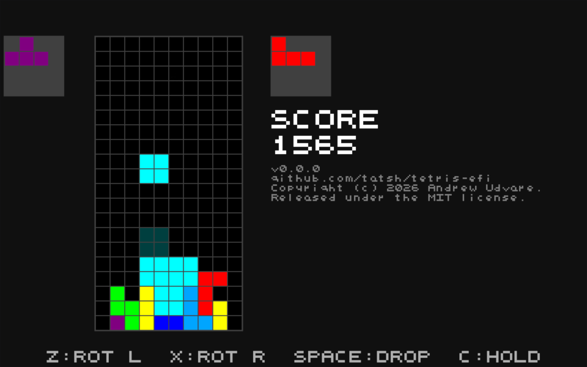

# Tetris for UEFI

<!-- WISWA-GENERATED-README:START -->

[](<https://en.wikipedia.org/wiki/C_(programming_language)>)
[](https://github.com/Tatsh/tetris-efi/tags)
[](https://github.com/Tatsh/tetris-efi/blob/master/LICENSE.txt)
[](https://github.com/Tatsh/tetris-efi/compare/v0.0.0...master)
[](https://github.com/dependabot)
[](https://tatsh.github.io/tetris-efi/)
[](https://github.com/Tatsh/tetris-efi/stargazers)
[](https://github.com/pre-commit/pre-commit)
[](https://cmake.org/)
[](https://prettier.io/)
[](https://github.com/Tatsh/tetris-efi/actions/workflows/tests.yml)
[](https://coveralls.io/github/Tatsh/tetris-efi?branch=master)

[](https://bsky.app/profile/Tatsh.bsky.social)
[](https://buymeacoffee.com/Tatsh)
[](irc://irc.libera.chat/Tatsh)
[](https://hostux.social/@Tatsh)
[](https://www.patreon.com/Tatsh2)

<!-- WISWA-GENERATED-README:STOP -->

A Tetris clone that runs as a UEFI application. It uses the Graphics Output Protocol (GOP) at the
firmware's current mode, draws coloured tetrominoes with a back-buffered + Blt render path,
includes a ghost-piece preview, and supports hold (store/recall). On game over you can start a
new game or quit back to the firmware.



Based on [hello-world-efi](https://github.com/Tatsh/hello-world-efi) and Roderick W. Smith's
[EFI programming](https://www.rodsbooks.com/efi-programming/hello.html) examples.

## Features

- **GOP rendering** - Double-buffered to RAM, pushed to the framebuffer with a single `Blt`, so
  no flicker.
- **Coloured tetrominoes** - I (cyan), O (yellow), T (purple), S (green), Z (red), J (blue),
  L (orange).
- **Ghost piece** - A dimmed preview of where the current piece will land on a hard drop.
- **Hold (store/recall)** - Press **C** to store the current piece or swap with the held piece
  (once per drop).
- **In-game UI** - Score, version + project URL, and on-screen controls hint, all drawn with a
  built-in 5x5 bitmap font.
- **Game over** - **N** for a new game, **Q** to quit to firmware.

## Controls

Arrow keys move; the four actions also have keyboard alternatives.

| Action            | Primary         | Alternates |
| ----------------- | --------------- | ---------- |
| Move left         | Left arrow      | `H`        |
| Move right        | Right arrow     | `L`        |
| Soft drop         | Down arrow      | `J`        |
| Hard drop         | Up arrow, Space | `K`        |
| Rotate left (CCW) | `Z`             | `A`        |
| Rotate right (CW) | `X`             | `S`        |
| Hold              | `C`             | _none_     |

## How to build

Required tools: `cmake`, GNU EFI, `mtools` (`mformat`, `mmd`, `mcopy`), and an ISO 9660 builder
that supports `-eltorito-platform efi` (`xorrisofs` from `xorriso`, or `mkisofs` from cdrtools).

1. Have `cmake` in your PATH.
2. Install GNU EFI on your system.
3. Clone this repository and open a terminal in its root.
4. `mkdir build && cd build`
5. `cmake -G Ninja ..` (or `cmake ..` for Make)
6. `ninja` (or `make`)

Output: `tetris.efi` and a minimal UEFI-bootable `tetris.iso` (~1.4 MB). The ISO contains a
single FAT EFI System Partition image carrying `\EFI\BOOT\BOOTX64.EFI`, exposed via El Torito
with platform ID 0xEF. UEFI firmware loads that file directly — no GRUB or other bootloader.

## Project layout

- `src/` - game code split into `font.{c,h}`, `piece.{c,h}`, `game.{c,h}`, `loop.{c,h}`,
  `render.{c,h}`, plus `main.c` (the EFI entry point).
- `tests/` - cmocka-based host tests.
- `CMakeLists.txt` - top-level build orchestration (compile, link `tetris.efi`, build the ISO,
  QEMU launcher target).

## How to run in QEMU

From the build directory:

```sh
ninja run-qemu      # or `make run-qemu`
```

The `run-qemu` CMake target auto-detects an installed OVMF firmware and boots `tetris.iso`.

## How to run tests

Configure with `-DBUILD_TESTS=ON` and run `ctest`:

```sh
cmake -G Ninja -DBUILD_TESTS=ON ..
ninja
ctest --output-on-failure
```

Tests live in `tests/` and use [cmocka](https://cmocka.org/). Each test executable compiles the
relevant `src/*.c` files directly so cmocka `--wrap` can intercept gnu-efi calls without
linking the full `libefi`/`libgnuefi` runtime. Tests can only be built with GCC.
